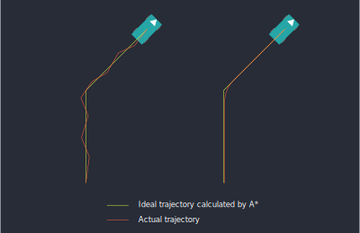

# Controls #

The purpose of our controls stack is to determine the motor outputs to get the robot from its current state to the
desired state as chosen by planning. Our robot effectively has 4 control surfaces: the left drive motor, the right drive
motor, the intake motors (three motors which we move as one unit), and the output motor. The majority of the
calculations in controls are for calculating the speeds of the drive motors.

Although the planning stack returns an entire trajectory consisting of multiple waypoints, controls is only focused on
the first waypoint (the current state) and the second waypoint in the trajectory. Note that this means that controls's
notion of "goal" is different from planning's.

Our current drive logic is very simple, as summed up in the flowchart below: if we're not facing the goal, turn until
we're facing the goal. If we *are* facing the goal, simply drive straight towards it. In our initial implementation, we
would move and turn at constant rates and would often overshoot our desired heading or position. To fix this, we added
PID loops to ensure we more accurately achieve the desired state and with minimal overshooting.

Controls also supports driving in reverse because we need to outtake balls into the goal from the rear of the robot. For
this case, we simply flip our desired heading by 180 degrees during turns and flip the signal to the motors when driving
straight.

Lastly, controls also supports running the intakes and outtake. There are currently only two supported modes: running
just the intakes or running just the outtake. In either case we simply run the intakes/outtake at full speed.

## Future Work ##

  - <input type="checkbox"> The robot currently only supports turning in-place or moving straight ahead, which can be
    very slow because time is lost during turns. Instead, the robot should implement turning while driving, as in a
    unicycle model, which would speed up its trajectory-following.

