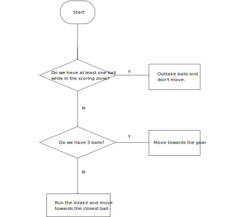

# Planning #

The purpose of our planning stack is to take the output of perception (detected balls and obstacles), pick a "behavior,"
which might be moving towards the goal, picking up more balls, etc., and choosing an immediate goal state to give to the
controls system to achieve. There are two main components to our planning stack: behavior planning and motion planning.

## Behavior Planning ##

The stack begins with behavior planning, which consists of the highest-level reasoning performed by our robot. At this
level, our robot decides whether it should continue picking up balls, head towards the goal, or outtake balls into the
goal. The final result of behavior planning is a physical location towards which the robot should drive towards, whether
to drive towards that goal forwards or backwards (drive forward to pick up balls or reverse towards the goal) and
whether or not the intake and/or outtake should be running. Our behavior planning logic is fairly simplistic at the
moment and can be summarized by this flowchart:

## Motion Planning ##

Our motion planning stack is concerned with determining how to get the robot from its current state to its goal state
chosen by behavior planning while avoiding obstacles -- static ones such as the columns on the field and dynamic ones
like other robots.

We chose to use A* for path planning because it is fast, simple to implement, and guarantees optimality. Since A*
requires an occupancy grid for planning, we designed an occupancy grid with 8-connected cells and an algorithm for
inserting arbitrary polygonal obstacles. It works well since our problem is only two-dimensional, and we haven't
encountered any memory problems while running on a 4th gen Raspberry Pi with 10 cm cells.

Since A* assumes that the robot is a point mass, we expand all our obstacles by approximately the radius of our robot.
However, this has the unfortunate side effect of no longer allowing us to pass through the trenches (since the robot
can't fit diagonally in the trenches). Another undesirable side-effect is that some balls now appear to be inside
obstacles and therefore unreachable.

Although motion planning is currently fast, our approach currently has inherent shortcomings. One way to overcome these
is to plan in the three-dimensional state space of the robot \\( (x, y, \phi) \\). Another way might be to use a motion
model to forward-simulate the robot during planning, although this can be computationally heavy. One simple solution to
the trench problem might also be to simply change the shape of the robot.

## Future Work ##

  - <input type="checkbox"> Special behavior during the autonomous period which tries to score as many balls as possible.
  - <input type="checkbox"> Special behavior for the endgame (last 10 seconds at the end of the game) to head directly for the center of the
        field and climb onto the Generator Switch for extra points.
  - <input type="checkbox"> All the obstacles on the field are currently dilated by the radius of the robot, which is half its diagonal
        length (effectively its largest radius). This works fine in most cases and prevents collisions, but
        unfortunately does not allow the robot to pass through the trench anymore because it is too large to fit
        diagonally in the trench. Planning in the state space or changing the shape of the robot would fix this.
  - <input checked type="checkbox"> Special behavior to move towards the human player station if no more balls are visible on the field.
  - <input checked type="checkbox"> Smooth out the kinks in A*'s plan.
  - <input type="checkbox"> Find a way to plan out of an obstacle if the robot drives into an occupied call.
  - <input type="checkbox"> If the current trajectory is very similar to the previous trajectory and is still obstacle-free, prefer the old
        trajectory. This will prevent the robot from jittering while trying to choose between two very similar plans.
